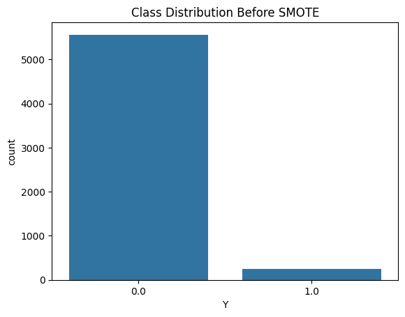
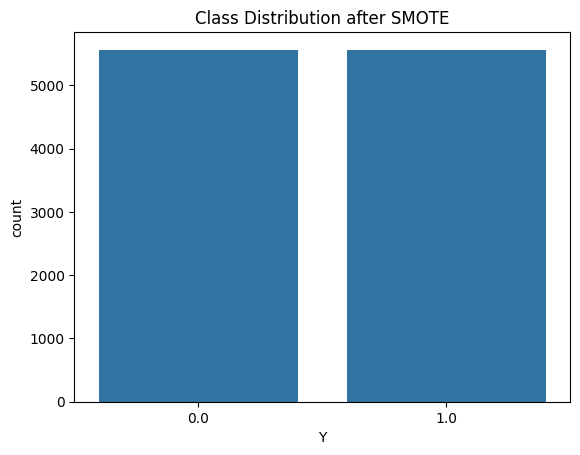

# Outreachy contribution period

## Dataset: Tox21

### 🌟 Why Tox21?

For this modeling exercise, I have selected the **Tox21 dataset** from the Therapeutics Data Commons (TDC). The choice of Tox21 is motivated by its significance, structure, and applicability in the field of drug discovery and computational toxicology.

---

### 🔑 1. Relevance to Drug Discovery and Toxicity Screening
Tox21 addresses one of the key challenges in the drug discovery pipeline—**predicting chemical toxicity**. Toxicity is a primary cause of drug failure in clinical stages. Tox21 contains bioassay data that evaluates compounds' toxic effects across **12 well-defined biological targets**, including nuclear receptor signaling pathways (e.g., estrogen receptor, androgen receptor) and stress response pathways (e.g., p53, mitochondrial membrane potential).

By modeling toxicity at the early screening stage, Tox21 allows us to filter out potentially harmful compounds, contributing to safer and more efficient drug development.

---

### 📊 2. Binary Classification-Friendly Structure
Tox21 provides clear **binary classification labels (toxic/non-toxic)** for each compound, making it ideal for machine learning classification tasks. This aligns directly with our objective of building classification models, simplifying the data processing and model evaluation steps.

---

### 🚀 3. Well-Established Benchmark Dataset
Tox21 is recognized as a benchmark dataset in the computational chemistry and machine learning communities. It is widely used for evaluating the performance of ML and DL models in toxicity prediction, ensuring our results are reproducible and comparable.

According to the research paper **"A Comparative Study of Deep Learning Models and Classification Algorithms for Chemical Compound Identification and Tox21 Prediction" (2024)**, Tox21 has been used effectively to benchmark several deep learning models (ResNet50V2, InceptionV3, MobileNetV2, VGG19) and traditional ML models (Random Forest, KNN), demonstrating its robustness and versatility.

---

### 💻 4. Computational Feasibility
With ~8,000 compounds and 12 tasks, Tox21 is **large enough to support deep learning applications**, but small enough to be computationally manageable on standard hardware. Unlike large-scale datasets like BindingDB (millions of entries), Tox21 allows for faster iterations and experimentation.

---

### 🧍‍♂️ 5. Multi-Task Learning Potential
Each compound in Tox21 is annotated with **12 different toxicity labels**, enabling us to explore **multi-task learning models** that predict multiple toxicity endpoints simultaneously. This improves generalization and can offer deeper insights into compound behavior across biological systems.

---

### 🌍 6. Real-World Use Cases
The Tox21 dataset has several practical applications:

- **Drug Discovery:** Early identification of toxic compounds before costly clinical trials.
- **Chemical Safety:** Screening environmental chemicals for toxicity.
- **Off-Target Prediction:** Ensuring that compounds binding to target proteins do not adversely affect other pathways.
- **Regulatory Compliance:** Supporting chemical safety regulations by predicting potential harmful effects.

---

### 📚 7. Backed by Literature

Our selection is further supported by:

1. Huang, K., Fu, T., Gao, W., Zhao, Y., Roohani, Y., Leskovec, J., & Coley, C. W. (2021). *Therapeutics Data Commons: Machine Learning Datasets and Tasks for Drug Discovery and Development*. NeurIPS 2021.

2. Alaca, Y., Emin, B., & Akgul, A. (2024). *A Comparative Study of Deep Learning Models and Classification Algorithms for Chemical Compound Identification and Tox21 Prediction*. Computers and Chemical Engineering, 189.

---

## Tox21 Data Processing and EDA

### Overview
This project consists of two Python scripts for handling the Tox21 dataset:
1. **Data Loading (`dataloader.py`)**: Defines a PyTorch Dataset class and functions to create DataLoaders for training, validation, and testing.
2. **Exploratory Data Analysis (`eda.py`)**: Performs exploratory data analysis (EDA) on the dataset, generating visualizations and summary reports.

### Installation
Ensure you have Conda installed. Create and activate a new Conda environment:
```bash
conda create --name tox21_env python=3.8
conda activate tox21_env
```

Install the required dependencies:
```bash
pip install -r requirements.txt
```

### Data Loading (`dataloader.py`)
#### Functionality
- Reads a Parquet file containing the Tox21 dataset.
- Splits the dataset into training, validation, and test sets.
- Converts data into a PyTorch-compatible Dataset and DataLoader.

#### Usage Example
```python
from dataloader import get_dataloader

train_loader, valid_loader, test_loader = get_dataloader("../data/Single/tox21_NR-AR.parquet")
```
#### Arguments
- `data_path` (str): Path to the dataset.
- `batch_size` (int, default=32): Number of samples per batch.
- `shuffle` (bool, default=True): Whether to shuffle training data.
- `train_frac` (float, default=0.7): Training dataset fraction.
- `val_frac` (float, default=0.1): Validation dataset fraction.
- `test_frac` (float, default=0.2): Test dataset fraction.
- `seed` (int, default=42): Random seed for reproducibility.

### Exploratory Data Analysis (`eda.py`)
#### Functionality
- Performs basic statistics and visualization of the dataset.
- Generates an EDA report including:
  - Summary statistics
  - Missing values heatmap
  - Histograms of features
  - Boxplots for outlier detection

#### Usage
Run the script from the command line:
```bash
python eda.py --file path/to/dataset.parquet --output output_directory/
```
#### Arguments
- `--file` (str, required): Path to the dataset file (CSV or Parquet).
- `--output` (str, required): Directory to save EDA results.

#### Output Files
- `eda_report.txt`: Summary of dataset properties.
- `summary_statistics.csv`: Descriptive statistics.
- `missing_values_heatmap.png`: Visualization of missing data.
- `feature_distributions.png`: Histogram of feature distributions.
- `boxplot_outliers.png`: Boxplot for outlier detection.

#### Notebooks  
  - `tox21_data_exploration_all.ipynb` – This notebook performs a **exploratory data analysis (EDA)** across all 12 toxicity endpoints in the Tox21 dataset. 

  - `tox21_data_exploration_single.ipynb` – Instead of analyzing all endpoints together, this notebook focuses on **a single toxicity endpoint** at a time. It allows for a more detailed feature-wise exploration, including outlier detection and feature importance for a specific target.


### 📌 Key Inferences from EDA  

- **Missing Values:** The dataset has minimal missing values, making it ready for modeling with little preprocessing.  

- **Class Imbalance:** Some toxicity endpoints show class imbalance, requiring techniques like resampling or weighted loss functions.    


## Featurization Script

This part focuses on processing and featurizing the Tox21 dataset for downstream machine learning tasks. The dataset contains molecular structures in SMILES format, along with labels for toxicity prediction. This repository provides scripts to:

1. Load and preprocess the Tox21_NR-AR dataset
2. Generate molecular embeddings using the ErsiliaCompoundEmbeddings model
3. Store the featurized dataset in Parquet format for efficient use

The Tox21 dataset comprises 12 distinct toxicity assays, including nuclear receptor signaling (e.g., NR-AR, NR-AhR) and stress response pathways (e.g., SR-ARE). While specialized models like the Cardiotoxicity Classifier (eos1pu1) are optimized for hERG inhibition (a single endpoint), they lack generalizability across diverse toxicity mechanisms.

- Compound Embeddings (eos2gw4), in contrast, provide task-agnostic molecular representations derived from:

- ChEMBL bioactivity data (broad coverage of protein targets)
- FS-Mol (few-shot learning benchmark for drug discovery)
- Multi-descriptor fusion (Grover + Mordred + ECFP)

This ensures that embeddings capture both structural and functional toxicity signals, making them suitable for all 12 Tox21 assays without bias toward a single endpoint.

### Description
The featurization script (`scripts/featuriser.py`) converts SMILES representations of molecules into numerical embeddings using the `ErsiliaCompoundEmbeddings` model.

### Usage
Run the script as follows:
```bash
python path/featuriser.py
```
### Workflow
1. Load the dataset (`tox21_NR-AR.parquet`)
2. Initialize the Ersilia compound embedding model
3. Convert SMILES into embeddings in batches (memory-efficient processing)
4. Save the processed dataset to `../output/Single/tox21_NR-AR_featurized.parquet`
5. Run validation checks to ensure correctness

### Expected Output
A new Parquet file containing:
- Original dataset columns
- A new column `embedding` (1024-dimensional vector representation of each molecule)

## Notebook Version
For an interactive version of this workflow, refer to `notebooks/featurisation.ipynb`, which provides step-by-step execution and visualization.

## Data Preprocessing
The TOX21 NR-AR dataset consisted of 7,265 compounds (6,956 negatives, 309 positives) exhibiting severe class imbalance (4.25% positive samples). Each compound was represented by:
- A 1024-dimensional molecular embedding vector
- Binary label (Y ∈ {0,1}) indicating androgen receptor activity

### Feature Engineering
1. **Embedding Expansion**:
   - Converted list-type embeddings into 1024 numerical features (emb_0 to emb_1023)
   - Verified dimensional integrity through dtype inspection (float32)

2. **Stratified Dataset Splitting**:
   - Partitioned data maintaining class proportions:
     - Training: 80% (n=5,812)
     - Validation: 10% (n=727)
     - Test: 10% (n=727)
   - Used random_state=42 for reproducibility

### Class Imbalance Mitigation
- Applied Synthetic Minority Over-sampling Technique (SMOTE) to training set only
- Generated synthetic positive samples until class balance was achieved
- Final training distribution: 5,812 negatives ↔ 5,812 positives

### Feature Standardization
The standardization is computed as:

$$
z = \frac{x - \mu}{\sigma}
$$

Where:
- \{ \mu \}: Mean of training data
- \( \sigma \): Standard deviation of training data


### Dimensionality Visualization
- Performed t-SNE (perplexity=30) on standardized features
- Visualized 2D projections to verify:
  - Class separation potential
  - Effectiveness of SMOTE augmentation
  - Absence of artificial clustering artifacts

**t-SNE (t-Distributed Stochastic Neighbor Embedding)** is a dimensionality reduction technique that visualizes high-dimensional data in 2D/3D by preserving local similarities. It helps in ML by **Revealing clusters/patterns** in complex data (e.g., molecular embeddings) and **Validating preprocessing** (e.g., checking if SMOTE creates realistic synthetic samples).  

<!-- 
*Fig. 1: Data flow from raw embeddings to processed splits* -->

## Data Preprocessing Steps

### 1. Load and Inspect Data

```python
df = pd.read_parquet("../data/Single/tox21_NR-AR_featurized.parquet")
print(f"Initial class distribution:\n{df['Y'].value_counts()}")
```
**Result**: The dataset is highly imbalanced (95.75% negative, 4.25% positive).

### 2. Process Embeddings

```python
# Expand 1024D embeddings into columns
embeddings_df = pd.DataFrame(df["embedding"].tolist())
embeddings_df.columns = [f"emb_{i}" for i in range(1024)]
```

**Result**: Expanded the embedding column into separate 1024 columns. Now we have total 10127 columns

### 3. Create Balanced Splits

```python
# Stratified 80/10/10 split
train_df, temp_df = train_test_split(df, test_size=0.2, stratify=df['Y'], random_state=42)
val_df, test_df = train_test_split(temp_df, test_size=0.5, stratify=temp_df['Y'], random_state=42)

# Apply SMOTE to training only
smote = SMOTE(random_state=42)
X_resampled, y_resampled = smote.fit_resample(train_df.filter(like="emb_"), train_df["Y"])
```

SMOTE is only applied to traing data and not to validation and test data to train a robust NN model and prevent datat leakage and overfitting. SMOTE generates synthetic compounds in chemically meaningful regions of feature space (visible in t-SNE plots as interpolated points between real actives). Unlike random oversampling, SMOTE also avoids creating duplicate samples that could artificially inflate validation metrics.

### 4. Feature Standardization


```python
scaler = StandardScaler()
X_train = scaler.fit_transform(X_resampled)  # Fit on resampled train
X_val = scaler.transform(val_df.filter(like="emb_"))  # Transform others
```

### Key Statistics

| Stage          | Negative Count | Positive Count | Ratio   |
|----------------|----------------|----------------|---------|
| Raw Data       | 6,956          | 309            | 22.5:1  |
| After SMOTE    | 5,812          | 5,812          | 1:1     |
| Validation Set | 696            | 31             | 22.5:1  |
| Test Set       | 696            | 31             | 22.5:1  |

## Visualization


```python
# Class distribution plots
fig, (ax1, ax2) = plt.subplots(1, 2, figsize=(12,4))
sns.countplot(x=train_df["Y"], ax=ax1).set_title("Before SMOTE")
sns.countplot(x=y_resampled, ax=ax2).set_title("After SMOTE")
```
<div style="display: flex; justify-content: space-between;">
  
  
</div>

## Reproducibility Notes
- All random operations seeded with `random_state=42`
- Validation/test sets remain completely unseen during SMOTE
- Standardization parameters (μ, σ) derived exclusively from training data


## Model Training
To be Updated...


## Acknowledgments
This project utilizes the [Ersilia](https://ersilia.io/) model for molecular embeddings.

## License
MIT License. See `LICENSE` for details.

